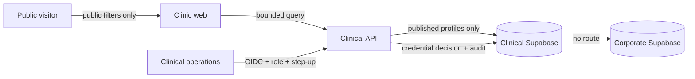
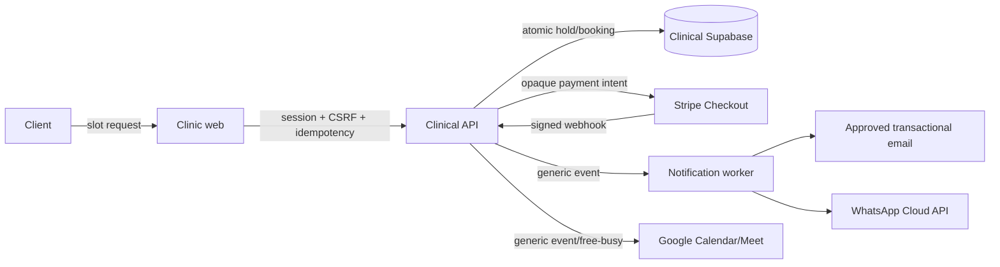
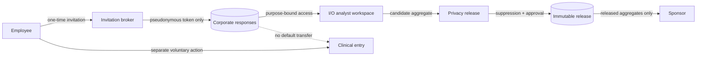

# Stage 01 Threat and Abuse Model

Status: BASELINE DEFINED — G1 security/privacy/clinical review required

| Flow                       | Primary abuse                                                  | Required mitigation/test                                                                              |
| -------------------------- | -------------------------------------------------------------- | ----------------------------------------------------------------------------------------------------- |
| Public directory           | Enumeration, unpublished profile leakage, scraping             | Published-state query, bounded filters, pagination, rate limit, generic errors                        |
| Booking                    | Slot race, replay, double booking, identifier guessing         | Atomic expiring hold, DB constraint, idempotency, state machine, non-guessable resource tests         |
| Invitation                 | Token brute force, replay, sponsor linkage, response lookup    | Hash at rest, scope/expiry/one-time use, rate limits, separate response identity, no enumeration      |
| Survey autosave/submit     | Missing-value confusion, duplicate submit, browser leakage     | Strict versioned schema, explicit missingness, idempotency, secure session, storage/log scan          |
| Analyst workspace          | Purpose creep, cross-tenant access, raw export                 | Assignment/purpose/expiry policy, query scope, export approval, read audit, denial matrix             |
| Privacy release            | Small cells, complementary suppression, differencing           | Versioned release policy, query history, segmentation limits, attack suite, immutable outputs         |
| Employer/clinical boundary | Utilisation inference, cross-plane access, accidental join     | Separate credentials/network/DBs, contract tests, sponsor released tables only, cross-plane denial    |
| Payment/webhook            | Forgery, replay, duplicate/refund mismatch                     | Signature/timestamp/event uniqueness, idempotency, reconciliation, no card data                       |
| Referral/entitlement       | Replay, excess context, employer status leakage                | Minimal one-time envelope, client consent, expiry/revocation, opaque decision, zero status return     |
| Logs/uploads               | Sensitive logging, malware, formula injection                  | Allow-listed redaction, content/type/size validation, malware scan, safe export encoding              |
| Google Calendar/Meet       | Clinical detail leakage, malicious calendar edit, token theft  | Minimal scope, generic content, encrypted token, app-authoritative state, divergence/revocation tests |
| WhatsApp/email             | Lock-screen disclosure, wrong recipient, consultation drift    | Explicit opt-in, generic approved templates, no clinical chat, preference/deduplication tests         |
| Vercel/Supabase            | Cross-plane access, leaked secret, permissive RLS, backup loss | Separate projects/keys, RLS/grant tests, TLS, paid backups/restore and cross-border approval          |
| Credential publication     | False/expired professional status                              | Independent evidence check, dual approval, expiry job, safe unpublish and public-cache purge          |

## Threat-model completion rule

For every row, record trust boundaries, assets, actors, likelihood/impact, control owner, test ID, and residual risk.
Security/privacy/clinical owners—not an AI agent—approve residual risk.

## Required data-flow boundaries

Each implementation records source/destination, class, purpose, authorization, TLS/encryption, audit identifier,
retention rule, failure behavior and ASVS test ID. These diagrams are contracts, not evidence of deployed controls.
